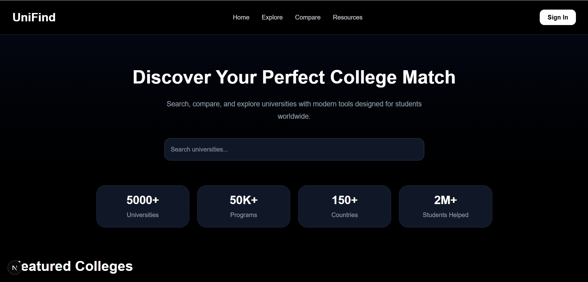
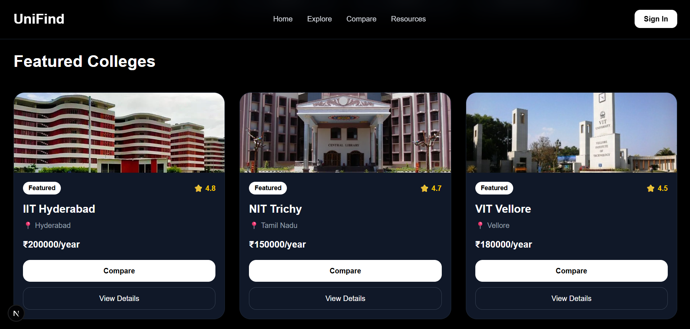
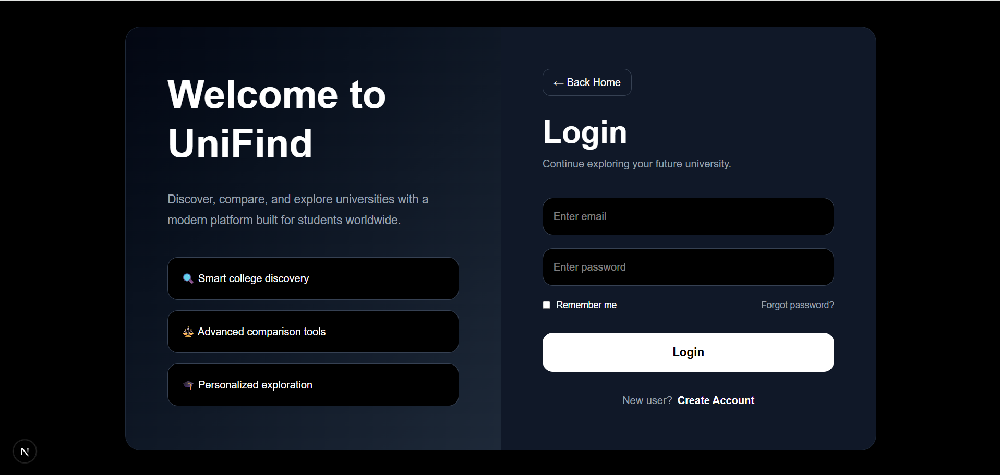
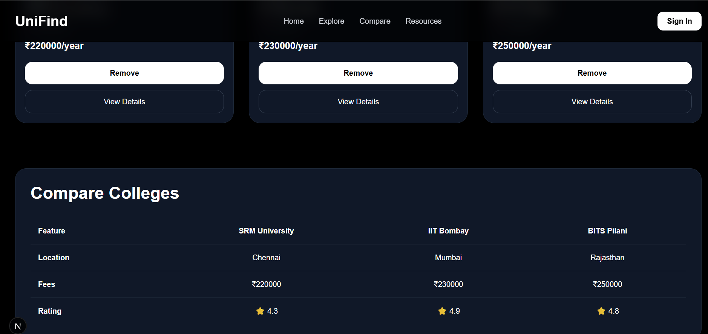

# UniFind – College Discovery & Comparison Platform

UniFind is a modern full-stack web application designed to help students discover, explore, and compare colleges easily. The platform provides an intuitive interface for searching universities, viewing detailed information, and comparing multiple colleges side by side

## Features

* Search and explore colleges
* View detailed college information
* Compare multiple colleges
* Modern responsive UI
* Dynamic routing with Next.js
* REST API integration
* Student-friendly interface

## Tech Stack

### Frontend

* Next.js
* React
* TypeScript
* Tailwind CSS

### Backend

* Express.js
* Node.js

## Project Structure

```bash
app/
 ├── college/
 ├── login/
 ├── page.tsx
 ├── layout.tsx
```

## Installation

Clone the repository:

```bash
git clone https://github.com/Dasari-Saniya/college-discovery-platform.git
```

Move into the project directory:

```bash
cd college-discovery-platform
```

Install dependencies:

```bash
npm install
```

Run the development server:

```bash
npm run dev
```

Open in browser:

```bash
http://localhost:3000
```

## Future Enhancements

* AI-based college recommendations
* Student reviews and ratings
* Scholarship information
* Authentication system
* Advanced filtering options

## Live Demo

https://college-discovery-platform-chi.vercel.app/

## Screenshots

### Home Page


### Explore Page


### Login Page


### Compare Page


## Author

Dasari Saniya
